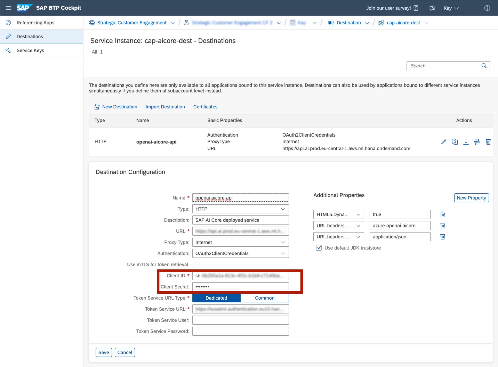

# Attach SAP BTP, AI Core to CAP via Destination

In the following parts, it's explained how the CAP boilerplate code needs to be extended to consume the inference service (proxy) of SAP BTP AI Core and expose it as an [action](https://cap.cloud.sap/docs/guides/providing-services#actions-and-functions) via an endpoint.

A destination service instance as well as an UAA service instance are attached to your CAP application in the `mta.yaml`. During the initial deployment, there is a destination with the neccessary information created which needs to get completed in the cockpit itself by entering the Client ID and Client Secret of your AI Core service key (see [Register general artifacts on SAP BTP, AI Core and inspect in SAP BTP, AI Launchpad](/documentation/01-ai-core-azure-openai-proxy/03-register-general-artifacts.md)):

```yaml
---
# mta.yaml
---
# -------------------- DESTINATION SERVICE -------------------
- name: cap-aicore-dest
  # ------------------------------------------------------------
  type: org.cloudfoundry.managed-service
  parameters:
    service: destination
    service-plan: lite
    config:
      init_data:
        instance:
          existing_destinations_policy: ignore
          destinations:
            - Name: openai-aicore-api
              Description: SAP AI Core deployed service
              URL: https://api.ai.prod.eu-central-1.aws.ml.hana.ondemand.com
              URL.headers.AI-Resource-Group: azure-openai-aicore # your resource group
              URL.headers.Content-Type: application/json
              Type: HTTP
              ProxyType: Internet
              Authentication: OAuth2ClientCredentials
              tokenServiceURL: https://sceaiml.authentication.eu10.hana.ondemand.com/oauth/token # your token service url of the SAP AI Core instance
              clientId: DUMMY_ID # enter in cockpit
              clientSecret: DUMMY_SECRET # enter in cockpit
              HTML5.DynamicDestination: true
```

1. Access the Destination Service on the SAP BTP Cockpit
   

2. Enter Client ID and Client Secret
   
